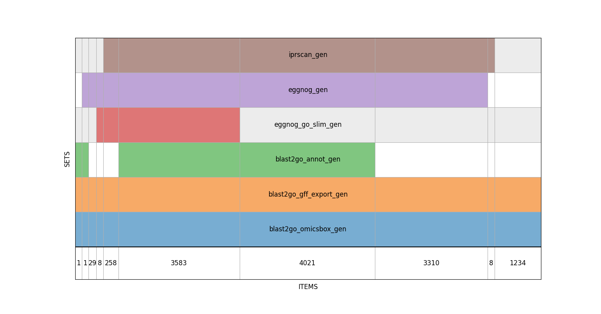
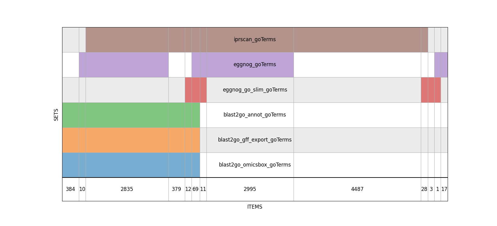

## Analysis and Enrichment of Trichoderma Genes and GO Terms

### Data and Methods
* **Input Files:**
  * blast2go_omicsbox_table.txt
  * blast2go_gff_export.gff
  * eggnog_trichoderma_atroviride_imi206040_v3_proteins_fa_eggnog_go_slim.txt
  * eggnog_Trichoderma_atroviride_IMI206040_V3.proteins.fa_eggnog.txt
  * iprscan_Tatro_V3_annotations.txt
  * blast2go.annot
* **GO Ontology:**
  * go.obo file downloaded from https://geneontology.org/docs/download-ontology/
  * Latest version as of 2024/11/03
* **Analysis Tools:**
  * Supervenn, https://github.com/gecko984/supervenn, for visualizing dataset overlaps

### Results
* **result_go_table.txt:**
  * Table format with columns for: gene ID, GO ID, GO name, and GO namespace
* **statistics.txt:**
  * Summary statistics including:
    * Gene and GO term counts per input file
    * Enrichment analysis results
    * List of deprecated genes
* **Visualizations:**
  * datasets_gen_comparison.png: Venn diagram showing gene overlap
  * datasets_goTerms_comparison.png: Venn diagram showing GO term overlap

### Summary
* **Objective:** To enrich and analyze GO terms associated with Trichoderma Atroviride genes.
* **Approach:**
  * Collected gene annotation data from various sources.
  * Utilized the GO ontology to provide functional descriptions of genes and filter deprecate ones.
  * Performed enrichment identifieng a comprehensive set of GO terms associated with Trichoderma Atroviride genes.
  * Visualized input dataset overlaps using Venn diagrams.
* **Findings:**
  * Analysis the source of GO terms and genes from various inputs datasets. 
  * Created a resource for further analysis of Trichoderma genomics.

### Mapping table of inputs files and gene/Go terms
| File | blast2go_omicsbox | blast2go_gff_export | blast2go.annot |  eggnog_go_slim | eggnog | iprscan |
| :---: | :---: | :---: | :---: | :---: | :---: | :---: |
| **gene** | SeqName | GFF qualifier: ID | Column index 1 | Query ID | Query ID | query |
| **GO terms** | GO IDs | GFF qualifier: Ontology_id | Column index 2 | GOs | GOs | GOs |

### Pipeline representation of the GO Analysis and Enrcichemnt process

### Overlaps analysis of GO terms and genes in the input files

